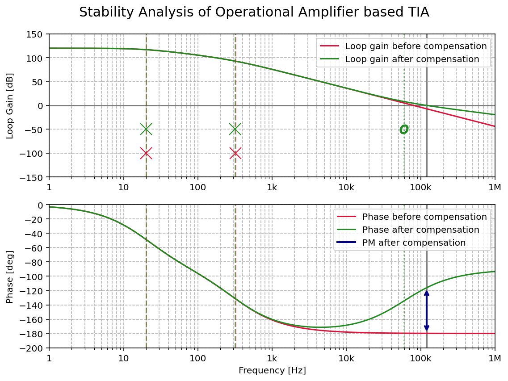

# TIA-stability-analysis
I've grown tired of the weird RoC (Rate of Closure) based method for stability analysis used by Analog Devices and Texas Instruments in their application notes. Decided to derive and simulate the circuit involving Loop-Gain plots and Bode stability criterion.

## Resulting plot:

## Mentioned application notes:
[Texas Instruments - What You Need to Know about Transimpedance Amplifiers](https://www.ti.com/lit/ta/ssztbc4/ssztbc4.pdf?ts=1770103794839)

[Analog Devices - Stabilize Your Transimpedance Amplifier](https://www.analog.com/en/resources/technical-articles/stabilize-transimpedance-amplifier-circuit-design.html)
